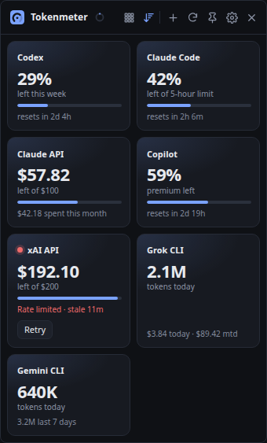
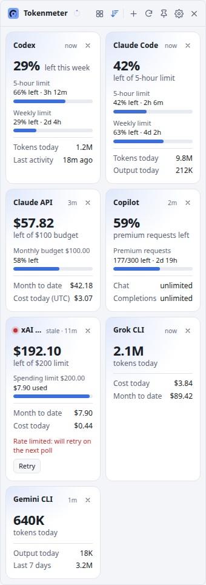
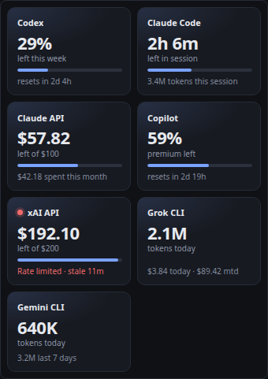

<p align="center">
  
</p>

<h1 align="center">Tokenmeter</h1>

<p align="center">
  <strong>See how much of your AI limits you have left, at a glance.</strong><br>
  A free, open-source, always-on-top desktop widget for Linux, Windows and macOS that tracks Claude Code, Codex, GitHub Copilot, Gemini CLI, Grok and your Claude, OpenAI and xAI API budgets.<br>
  <a href="https://mugeshk97.github.io/tokenmeter/">Website</a> · <a href="#install">Install</a> · <a href="https://github.com/mugeshk97/tokenmeter/releases/latest">Download</a>
</p>

<p align="center">
  <a href="https://github.com/mugeshk97/tokenmeter/releases/latest"></a>
  <a href="https://github.com/mugeshk97/tokenmeter/actions/workflows/test.yml"></a>
  <a href="LICENSE"></a>
  
</p>

<p align="center">
  
  &nbsp;
  
</p>
<p align="center"><sub>Compact (dark) and Normal (light), with sample data.</sub></p>

---

## Why Tokenmeter

AI coding tools meter you in different ways: 5-hour windows, weekly limits, premium-request quotas, monthly budgets. Each keeps its numbers on its own page. Tokenmeter puts them side by side on your desktop and leads with **what's left**, so you know which tool you can lean on before you hit a wall.

- **What's left, first.** Every card headlines its tightest limit: "42% left of 5-hour limit", "29% left this week", "$57.82 left of $100".
- **Closest to running out comes first.** Cards sort by nearest limit (or drag them into your own order).
- **Red means act.** Once 80% of a limit is used, the number and bar turn red and get a warning icon.
- **Local-first and private.** Most cards read files your tools already write on your computer. API keys are encrypted with your system keychain and only ever sent to that provider.
- **Stays out of the way.** Pinned, it shows only the cards; the controls slide in when you hover.
- **Keeps itself current.** Updates install automatically on Windows and through apt on Linux.

## Supported tools

| Tool | Where the numbers come from | Setup | Shows |
|---|---|---|---|
| **Claude Code** | Your plan's limits from Anthropic (using Claude Code's sign-in), plus local transcripts in `~/.claude/projects` | None | 5-hour and weekly limits left with reset times, tokens today, top model, plan, hourly chart |
| **Codex** | Local session logs in `~/.codex/sessions` | None | 5-hour and weekly limits left with reset times, tokens today, plan |
| **Gemini CLI** | Saved chats in `~/.gemini/tmp` | None | Tokens today and last 7 days, top model, hourly chart |
| **Grok CLI** | Local session logs in `~/.grok/sessions` | None | Tokens today, cost today and this month (as the CLI reports it), cache hits |
| **GitHub Copilot** | GitHub's Copilot quota endpoint | A GitHub token (`gh auth token`) | Premium requests left with reset date; chat and completions quota |
| **Claude API** | Anthropic Usage & Cost Admin API | Admin API key | Money left of your monthly budget, spend today and this month, tokens, cache hits |
| **xAI API** | xAI Management API | Management key + team ID | Money left of your spending limit, spend, top model, prepaid credit |
| **OpenAI API** *(off by default)* | OpenAI organization Costs & Usage API | Admin key | Money left of your monthly budget, spend, tokens and requests |

Local cards refresh every minute; API cards every 5 minutes by default (you can change it in Settings).

## Install

Download the latest version from **[GitHub Releases](https://github.com/mugeshk97/tokenmeter/releases/latest)**.

### Linux (Debian, Ubuntu and derivatives)

Add the Tokenmeter apt repository once; updates then arrive with your other system updates:

```bash
curl -fsSL https://mugeshk97.github.io/tokenmeter/tokenmeter-archive-keyring.gpg | sudo tee /usr/share/keyrings/tokenmeter-archive-keyring.gpg >/dev/null
echo "deb [arch=amd64 signed-by=/usr/share/keyrings/tokenmeter-archive-keyring.gpg] https://mugeshk97.github.io/tokenmeter stable main" | sudo tee /etc/apt/sources.list.d/tokenmeter.list
sudo apt update && sudo apt install tokenmeter
```

The repository is signed with key `51E7 3671 79B2 798A B250  5D10 7CFF 9452 0564 EA38`. You can also install the `.deb` from the release page directly (`sudo apt install ./tokenmeter-*-amd64.deb`).

### Windows

Run `tokenmeter-<version>-setup-x64.exe`. The installer isn't code-signed yet, so SmartScreen may warn about an unknown publisher: click **More info → Run anyway**. Tokenmeter then updates itself.

### macOS

With [Homebrew](https://brew.sh):

```bash
brew install --cask mugeshk97/tap/tokenmeter
```

Or download the `.zip` for your Mac from the release (`arm64` for Apple Silicon, `x64` for Intel), double-click it, and move **Tokenmeter.app** to Applications. The app isn't signed with an Apple Developer ID yet, so macOS blocks the first launch: open **System Settings → Privacy & Security** and click **Open Anyway** next to Tokenmeter (on macOS 14 and older, right-click the app → **Open** also works). Tokenmeter lives in the menu bar, with no Dock icon.

## Getting started

1. **Launch Tokenmeter.** Local tools (Claude Code, Codex, Gemini CLI, Grok CLI) show up on their own if you use them.
2. **Add keys for API tools** in **Settings** (the gear icon), or click **Set up** on the "not set up" line at the bottom of the widget:
   - **Claude API:** [Claude Console](https://platform.claude.com) → Settings → Admin Keys (organization accounts only).
   - **xAI API:** console.x.ai → Settings → Management Keys, plus your team ID from Team settings.
   - **OpenAI API:** platform.openai.com → Settings → Organization → Admin keys.
   - **GitHub Copilot:** run `gh auth token` and paste the output.
   - Optional: set a monthly budget for the Claude, OpenAI or xAI API to see money left instead of money spent.
3. **Make it yours.** Tick **Start at login**, hide tools you don't use (× on a card, bring them back with **+**), and pick a card size.

<p align="center">
  
</p>
<p align="center"><sub>Pinned (the default): just the cards. Hover to bring back the controls.</sub></p>

## Using Tokenmeter

| | |
|---|---|
| **Card size** | The grid icon in the header cycles Compact → Normal → Detailed. |
| **Order** | The sort icon puts the card closest to its limit first (on by default). Drag a card, press Alt+arrow keys on it, or right-click it to set your own order. |
| **Pin** | Pinned keeps Tokenmeter above other windows and hides everything but the cards; hover (or Tab) to reveal the top bar. Drag the top bar to move the widget. |
| **Card menu** | Right-click a card (or press the menu key) to move it, hide it, or open that tool's usage page. |
| **Refresh** | The small ring next to the name fills until the next API refresh; hover it for exact times, or click refresh. |
| **Errors** | A failed card says why and offers **Retry** or **Fix key**. A red dot marks it; a grey dot means not set up. |
| **Tray** | Closing hides Tokenmeter to the tray (menu bar on macOS). The tray menu has Show/Hide, Refresh, Always on top, Start at login, Check for updates, Settings and Quit. |
| **Theme** | Follows your system's light or dark mode, or pick one in Settings. |

Everything works from the keyboard, and screen readers announce when a tool starts failing or recovers.

## Updates

Tokenmeter checks for a new version shortly after it starts and every 6 hours (or **Check for updates** in the tray menu). When one is out, an update icon appears in the header.

| Installed with | What happens |
|---|---|
| Windows installer | Downloads in the background and installs when you quit (or click the update icon to restart now). |
| apt (Linux) | Arrives through Software Updater or `sudo apt upgrade`. |
| Homebrew (macOS) | `brew upgrade --cask tokenmeter`; the update icon reminds you. |
| macOS `.zip` | The update icon opens the download page (automatic updates need a signed app). |

Turn off **Install updates automatically** in Settings to always just be told.

## Privacy and security

- **Your usage data stays on your computer.** Local cards only read files your tools already write. The Claude Code card also asks Anthropic for your plan limits with the sign-in Claude Code already saved; that token is only sent to Anthropic and never shown or stored by Tokenmeter. Nothing is sent to Tokenmeter or any third party; there is no analytics or telemetry.
- **Keys are encrypted** with your operating system's keychain (macOS Keychain, Windows DPAPI, or GNOME Keyring / KWallet on Linux) and stored in Tokenmeter's settings folder, readable only by you. If Linux has no keyring running, Settings warns you that keys are stored without encryption.
- **Keys go only to their own provider** (for example, your Anthropic key only to `api.anthropic.com`), never to the widget's page.
- **The widget page is locked down:** no Node.js access and a strict Content Security Policy with no remote content.
- You can use environment variables instead of saved keys: `ANTHROPIC_ADMIN_KEY`, `XAI_MANAGEMENT_API_KEY` + `XAI_TEAM_ID`, `OPENAI_ADMIN_KEY`, `GITHUB_TOKEN`.

Found a security problem? Please report it privately through [GitHub security advisories](https://github.com/mugeshk97/tokenmeter/security/advisories/new) rather than a public issue.

## What the numbers mean

- **Claude Code:** limits come from the same (undocumented) endpoint Claude Code's `/usage` uses, refreshed every few minutes. If Claude Code isn't signed in, or its sign-in has expired, the card shows only today's tokens until you open Claude Code again.
- **Codex:** shows the rate-limit snapshot Codex saves after each turn, so it updates when you use Codex. Usage from ChatGPT on the web appears after a local session records it.
- **GitHub Copilot:** uses the same undocumented endpoint as the Copilot editor extensions, which GitHub could change without notice.
- **Gemini CLI:** Gemini API keys have no usage endpoint, so only usage through the CLI is counted.
- **Grok CLI:** the cost is what the CLI reports (the API-equivalent price), not your grok.com subscription bill. Key-based spend is on the xAI API card.
- **Claude API:** data typically arrives within about 5 minutes; daily costs use UTC days, and Priority Tier cost isn't included.

## Troubleshooting

- **No tray icon on GNOME:** install the *AppIndicator and KStatusNotifierItem Support* extension (Ubuntu ships it).
- **Not staying on top on Wayland:** Wayland doesn't let apps keep themselves on top or pick their position, so Tokenmeter runs through XWayland by default (Settings → "Use XWayland on Wayland").
- **A local tool shows no data:** check its folder in Settings; the defaults are `~/.claude`, `~/.codex`, `~/.gemini` and `~/.grok` (for example `C:\Users\you\.codex` on Windows).
- **Moving from "AI Usage Widget":** Tokenmeter copies your old settings on first start. Saved keys may need re-entering, because the keychain entry is tied to the app name.

## For developers

Tokenmeter is an Electron app written in plain JavaScript, with no UI framework and no build step for the app itself.

```bash
git clone https://github.com/mugeshk97/tokenmeter.git
cd tokenmeter
npm install
npm start          # run from source
npm run demo       # the UI with sample data, no keys needed
npm test           # provider and parser tests (no network)
npm run dist       # installers for the OS you're on
```

```
src/main.js            window, tray, IPC, autostart, polling lifecycle
src/updater.js         auto-update from GitHub Releases
src/preload.js         the small API exposed to the page (no Node.js in the renderer)
src/config.js          settings and encrypted secrets
src/poller.js          refresh scheduling; keeps the last good numbers when a call fails
src/providers/*.js     one module per tool, each returning a normalized card
src/renderer/*         the widget UI (strict CSP, no remote content)
test/                  node:test suite with mocked API responses and fake log folders
packaging/apt/         builds the signed apt repository
scripts/               icon generation from assets/logo.svg
```

Want to add a tool, fix a bug or improve the UI? See **[CONTRIBUTING.md](CONTRIBUTING.md)** for the development workflow, how to add a provider, and how releases are made.

## License

[MIT](LICENSE) © Mugesh Kannan K S
